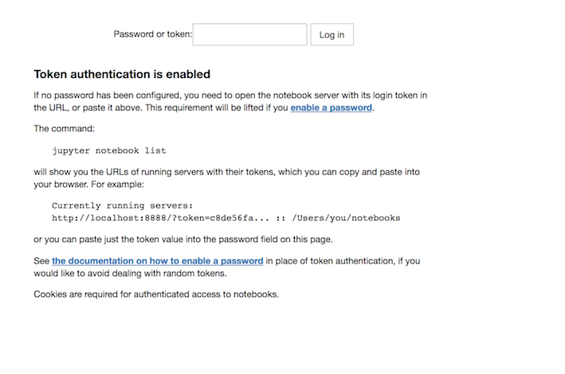

# How to set up a remote Jupyter on Google Cloud

## A - Overview

Why do that instead of a local Jupyter, which is even simpler to [install and run](http://jupyter.readthedocs.io/en/latest/install.html#installing-jupyter-using-anaconda-and-conda) ?
+ Because you can access a powerful machine, with big CPU/GPU, RAM, disk space, etc.
+ Typical use case: Machine learning.

Any difference ?
+ You need internet access.
+ The cloud machine is Linux.

How long does it take to set up ?
+ Less than 5mn the first time, the longest part is required only once.
+ Less than 1mn if you install Miniconda and have all the bash scripts ready.
+ The longest part is the Anaconda installation itself.
+ Less than 30s from the second time if you have created a disk snapshot from the first installation.

How much does it cost ?
+ It depends on the type of machine (VM) you use, and how long.
+ See Google Cloud [Compute Engine pricing](https://cloud.google.com/compute/pricing).  
+ **IMPORTANT**: Do not forget to stop your VM after you're done to avoid paying for nothing.

## B - Step by step guide

### 0 - Prerequisite

You need:
+ Internet access
+ a Google identity - you have one with a gmail account for example.

### 1 - Install gcloud command line tool on local machine
+ See [gcould install guide](https://cloud.google.com/sdk/docs/quickstarts)
+ First authenticate ([doc](https://cloud.google.com/sdk/gcloud/reference/auth/login)):
```bash
gcloud auth login
```
+ Then set up your environment ([doc](https://cloud.google.com/sdk/gcloud/reference/init)):
```bash
gcloud init
```
+ Finally check your status ([doc](https://cloud.google.com/sdk/gcloud/reference/config/list)):
```bash
gcloud config list
```

### 2 - Create new project on Google Cloud

My recommendation is to it from the the [gcloud console](https://console.cloud.google.com/) the first time:

+ Go to [gcloud console](https://console.cloud.google.com/)
+ Create a new project e.g. remotejupyterserver

+ Enable billing for this project, if necessary
    + See [Google help page](https://support.google.com/cloud/answer/6288653#new-billing)
    + Check out [Google Platform Free Tier](https://cloud.google.com/free/)

Next time you can simply the gcloud command line ([doc](https://cloud.google.com/sdk/gcloud/reference/projects/create)), for example:
```bash
gcloud projects create "myuniqueeprojectname" --name "my project human readable name"
```


### 3 - Create remote VM on Google Cloud

My recommendation is to it from the the [gcloud console](https://console.cloud.google.com/) the first time:
+ Go to Compute Engine / VM instances
+ Create a VM. There is a [lot of choice](https://cloud.google.com/compute/docs/machine-types). You are asked about the following main characteristics
    + name
    + zone (choose your area, obviously - this cannot be changed later)
    + machine type, CPU and memory
    + Boot disk
    + firewall rules

One you have customized your machine to your taste, you can get the equivalent REST of command line instructions, at the bottom of the creation page.

Example for the command line, with main options only:
```bash
gcloud compute instances create myserver \
    --image-project "ubuntu-os-cloud" \
    --image "ubuntu-1404-trusty-v20170831" \
    --zone "europe-west3-b" \
    --machine-type "n1-highmem-4"
```

### 4 - Check remote VM is up and running

+ From the [gcloud console](https://console.cloud.google.com/) in Compute Engine / VM instances
+ Or command line:
```bash
gcloud compute instances list
```

### 5 - Create ssh keys on local machine

+ In terminal run `gcloud compute config-ssh`. This will check if an RSA Pub-Prv key pair exists or create one if not.

+ Check result in `~/.ssh`

```bash
cat config # human readable info
cat google_compute_engine # RSA private key
cat google_compute_engine.pub # RSA public key
cat google_compute_known_hosts # Google remote machines confirmed as known by user
```
+ For more info about gcloud ssh instructions: see the [doc](https://cloud.google.com/sdk/gcloud/reference/compute/config-ssh)
+ For more info about ssh independently of gcloud see the [github help page](https://help.github.com/articles/connecting-to-github-with-ssh/) for example.

### 6 - Log in remote VM from local machine

Using the ssh keys created in previous step.

+ Terminal:
```bash
ssh myserver.europe-west3-b.remotejupyter
```
+ Alternative syntax:
```bash
gcloud compute --project "remotejupyter" ssh --zone "europe-west3-b" "myserver"
```

The ssh keys are not necessary if you log in the VM from the SSH / Open in browser window drop down menu.
+ from [gcloud console](https://console.cloud.google.com/) / Compute Engine / VM instances, click on the SSH button for your VM


### 7 - Install software on remote VM

The followings instructions must be run on your remote RM.  
You can install the Anaconda or Miniconda distributions or both.  
You can have any number of Anaconda2/3 or Miniconda2/3 distributions installed side by side.  

```bash
# update package manager
sudo apt-get update

# install utilities
sudo apt-get -y install bzip2 wget git

# ANACONDA
# download Anaconda linux version (link from page https://www.continuum.io/downloads)
anaconda="Anaconda3-4.4.0-Linux-x86_64.sh" # update if necessary
wget -P Downloads/ https://repo.continuum.io/archive/${anaconda}
# install anaconda - accept default options except yes to prepend anaconda path to PATH
bash ~/Downloads/${anaconda}

# MINICONDA
# download Miniconda linux version (link from page https://www.continuum.io/downloads)
miniconda="Miniconda3-4.3.14-MacOSX-x86_64.sh" # update if necessary
wget -P Downloads/ https://repo.continuum.io/miniconda/${miniconda}
# install miniconda - accept default options except yes to prepend anaconda path to PATH
bash ~/Downloads/${miniconda}

# run .bashrc to update path
. ~/.bashrc

# update python packages - using conda - example
conda update -y conda jupyter jupyter_client jupyter_console jupyter_core \
                ipython scipy numpy matplotlib pandas

# update python packages - using conda - example
pip install ezhc ezvis3d
```

The VM is all set.


### 8 - Set up port forwarding on local machine

+ Forward a local port (8888) to the server’s port (8888) where jupyter server is running:
```bash
ssh myserver.europe-west3-b.remotejupyter -NL 8888:localhost:8888
```
+ Alternative syntax:
```bash
gcloud compute ssh --project "remotejupyter" --zone "europe-west3-b" "myserver" -NL 8888:localhost:8888
```
+ For more info on ssh tunnels see [this article](https://solitum.net/an-illustrated-guide-to-ssh-tunnels/)

### 9 - Launch jupyter on remote VM

+ Create a directory to contain your notebooks and launch jupyter from there:
```bash
mkdir notebooks
cd notebooks
jupyter notebook --no-browser --port=8888
```
+ The terminal will show something along these lines:
```bash
Olivier@myserver:~/notebooks$ jupyter notebook --no-browser --port=8888
[I 11:42:10.851 NotebookApp] Serving notebooks from local directory: /home/Olivier/notebooks
[I 11:42:10.851 NotebookApp] 0 active kernels 
[I 11:42:10.851 NotebookApp] The Jupyter Notebook is running at: http://localhost:8888/?token=31913c18411cf0fe2593bfb8e0136631c7f5fadac3b62f4a
[I 11:42:10.851 NotebookApp] Use Control-C to stop this server and shut down all kernels (twice to skip confirmation).
[C 11:42:10.851 NotebookApp] 
    
    Copy/paste this URL into your browser when you connect for the first time,
    to login with a token:
        http://localhost:8888/?token=31913c18411cf0fe2593bfb8e0136631c7f5fadac3b62f4a
```
+ Copy the token

### 10 - Open browser local machine

+ Open web browser to `localhost:8888`
+ Paste the token from the jupyter server as requested


All good.  
You can start working !

### 11 - Stop of delete you VM when you are finished

Be careful it is all too easy to forget !


Stopping a VM does not delete is completely and consequently carries residual costs.  
See [Google doc](https://cloud.google.com/compute/docs/instances/stopping-or-deleting-an-instance#billing_for_stopped_instances)

Before deleting a VM, you might want to take a snapshot of the VM persistent disk to quickly back up the disk so you can recover lost data, transfer contents to a new disk.  

Several ways to do that from [gcloud console](https://console.cloud.google.com/) / Compute Engine:
+ In menu Snapshots, take a snapshot of the VM disk. You must stop the VM to do so
+ In the VM dashboard, untick _Delete boot disk when instance is deleted_ to make sure you will not lose anything
+ You can then create a new instance by choosing as boot disk this snapshot
+ You may also create an image from a snapshot and create an instance from an image
+ For more info about images and snapshots, see the [doc](https://cloud.google.com/compute/docs/disks/create-snapshots). Essentially snapshots are faster and cheaper

## C - More with Jupyter on Google Cloud

The following pages describe more specific Jupyter installations:
+ [Running Jupyter notebooks on GPU on Google Cloud](https://medium.com/google-cloud/running-jupyter-notebooks-on-gpu-on-google-cloud-d44f57d22dbd) with main packages [tensorflow](https://www.tensorflow.org/) and [keras](https://keras.io/)
+ [Containerized Jupyter notebooks on GPU on Google Cloud](https://medium.com/google-cloud/containerized-jupyter-notebooks-on-gpu-on-google-cloud-8e86ef7f31e9) - follow up from previous article: easier way with [Docker containers](https://www.docker.com/what-container)
+ [Google Cloud Platform for data scientists: using Jupyter Notebooks with Apache Spark on Google Cloud](https://cloud.google.com/blog/big-data/2017/02/google-cloud-platform-for-data-scientists-using-jupyter-notebooks-with-apache-spark-on-google-cloud) - from [Google Cloud Platform blob](https://cloudplatform.googleblog.com/)
+ [Google Cloud tutorial for Convolutional Neural Networks for Visual Recognition course](http://cs231n.github.io/gce-tutorial/) - for Stanford course [CS231n](http://cs231n.github.io/)
+ [How to install and run a Jupyter notebook in a Cloud Dataproc cluster](https://cloud.google.com/dataproc/docs/tutorials/jupyter-notebook) - from [Google Cloud documentation](https://cloud.google.com/docs/)
+ [Launch a GPU-backed Google Compute Engine instance and setup Tensorflow, Keras and Jupyter](https://hackernoon.com/launch-a-gpu-backed-google-compute-engine-instance-and-setup-tensorflow-keras-and-jupyter-902369ed5272) - for Udacity course [Self-Driving Car Nanodegree](https://www.udacity.com/drive)

The following pages describe JupyterHub installations:
+ [JupyterHub on Google Cloud](https://www.oreilly.com/ideas/jupyterhub-on-gcloud) - from [O'Reilly Ideas](https://www.oreilly.com/ideas)
+ [Using TensorFlow and JupyterHub in Classrooms](https://cloud.google.com/solutions/using-tensorflow-jupyterhub-classrooms) - from [Google Cloud documentation](https://cloud.google.com/docs/)
